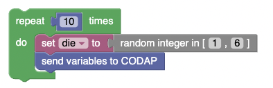

# simmer

Note: very early, proof-of-concept,
can change radically at any time, or even vanish!
You have been warned!

This plugin lets you use block programming to create probability (or physics!) simulations.

Look for the **Send variables to CODAP** block in the **CODAP** section.
That emits whatever variables you have defined into a CODAP dataset.

A simple die-rolling simulation might look like this:

### credits

<a href="https://www.flaticon.com/free-icons/play-button" title="play button icons">
Play button icon created byRoundicons - Flaticon</a> 
<a href="https://www.flaticon.com/free-icons/shrink" title="shrink icons">
Shrink icon created by Freepik -Flaticon</a> 
<a href="https://www.flaticon.com/free-icons/expand" title="expand icons">
Expand icon created by Freepik - Flaticon</a> 
<a href="https://www.flaticon.com/free-icons/shrink" title="shrink icons">
Shrink icons created by Swifticons - Flaticon
</a>
<a href="https://www.flaticon.com/free-icons/expand" title="expand icons">
Expand icons created by Swifticons - Flaticon</a>