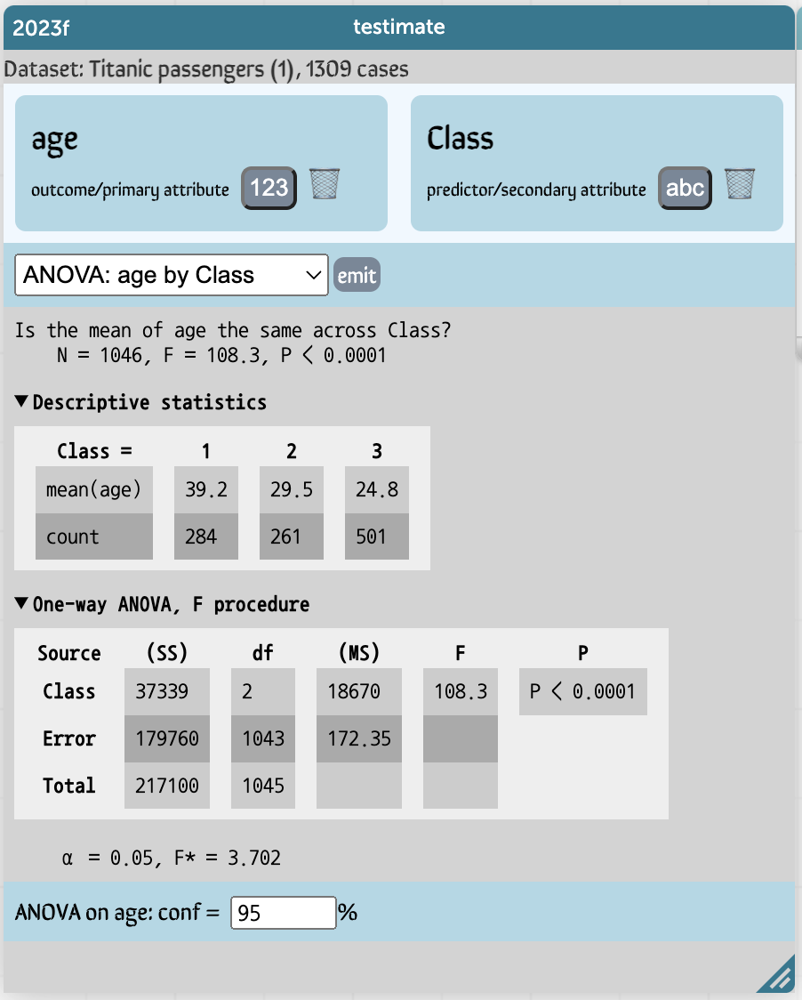

# testimate

This plugin lets you perform the traditional, frequentist, parametric tests that AP Stats requires.

Drag attributes onto the spaces provided. 
Put the principal, "outcome" variable in the space on the left.
For a test with only one variable, put the corresponding attribute there.

For tests with two variables, put the secondary (or predictor) variable on the right. 

Choose a suitable test from the menu.
The menu shows the tests that "work" given the types of attributes in the spaces. 
The plugin tries to infer types from the data,
but sometimes you have to tell it, 
for example, with the Titanic `Class` attribute, which has values of 1, 2, and 3, but is really categorical.
To change the type of an attribute, click the `123/abc` button.

# Available tests

|  | numeric on left                                                                                   | categorical on left                                                                         |
|------------------|---------------------------------------------------------------------------------------------------|---------------------------------------------------------------------------------------------|
|  nothing on the right    | test mean (t)                                                                                     | test proportion (z)  test proportion (binomial)  goodness of fit (chisq)              |
|  numeric on right | difference of means (t, two sample)  paired difference (t) linear regression correlation | logistic regression                                                                      |
| categorical on right | difference of means (t, grouped)  one-way ANOVA (F)                                            | difference of proportions (z) difference of proportions(grouped) independence (chisq) |

## ANOVA example
This is the most complicated display, of course, but gives you the basic idea:

